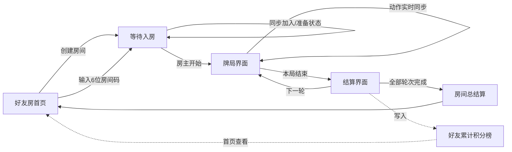
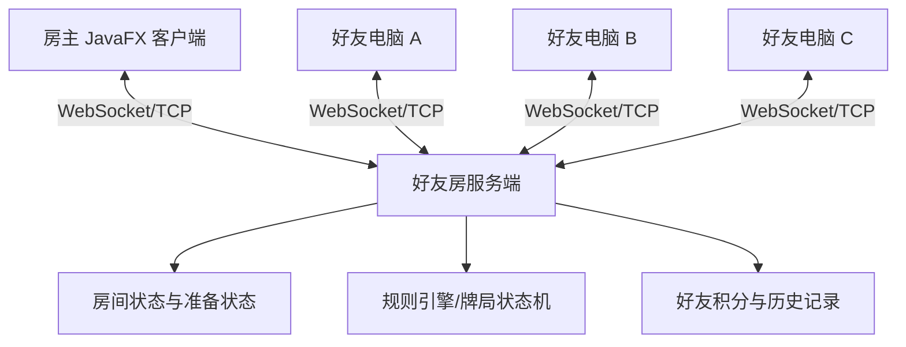

# 联机好友麻将流程与接口设计

当前产品只提供多电脑联机好友房，不提供随机匹配场。JavaFX 页面 Demo 使用模拟数据；正式联网实现应接入 TCP/WebSocket 服务，并以服务端状态为准。

## 页面流程



## 多电脑联机结构



## 核心接口

| 接口 | 责任 |
|---|---|
| `FriendRoomService.create` | 房主创建房间，返回房间码和服务地址 |
| `FriendRoomService.joinByInviteCode` | 好友在其他电脑通过房间码加入 |
| `FriendRoomService.observe` | 实时接收玩家进入、准备、离开和房间配置变化 |
| `FriendRoomService.setReady/start` | 玩家准备及房主开始牌局 |
| `GameSessionService` | 获取牌局快照、合法动作、提交操作和读取结算 |
| `GameEventBus` | 将服务端房间/牌局事件分发给 JavaFX Controller |
| `FriendScoreService` | 查询好友累计积分排行和最近共同对局玩家 |
| `MahjongRuleEngine` | 四川、长沙、北方和红中麻将的规则插件 |

## 状态同步原则

- 服务端是房间、手牌、出牌顺序和结算分数的唯一可信来源。
- 客户端只能看到自己的暗牌；其他玩家仅同步牌数、弃牌和公开组合。
- 操作携带 `expectedRevision`，服务端拒绝过期或重复动作。
- 等待页订阅房间快照，牌局页订阅牌局事件，并始终以服务端完整快照刷新界面。
- 每局结算写入房间积分；全部轮次结束后写入好友累计积分榜。

## 页面文件

```text
home-view.fxml          创建房间、加入房间、好友积分榜
waiting-room-view.fxml  房间码、玩家座位、准备与房主开局
game-view.fxml          四方牌桌、手牌和操作区
settlement-view.fxml    单局得分、房间排名、好友累计排名
```
