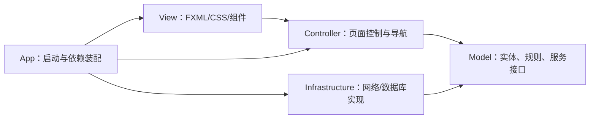

# MVC 项目包结构

## 总体依赖方向



约束：View 不直接访问数据库和网络；Controller 不实现麻将规则；Model 不依赖 JavaFX；Infrastructure 只实现 Model 定义的接口。

## Java 源码包

```text
com.campus.mahjong
├─ app/                              # 程序入口和依赖装配
│  └─ MainApplication
├─ model/                            # M：数据、领域规则、业务接口
│  ├─ common/                       # 当前共享枚举和值对象
│  ├─ dto/                          # 联网请求、响应、快照 DTO
│  ├─ entity/
│  │  ├─ player/                    # 玩家实体
│  │  ├─ room/                      # 房间与座位实体
│  │  ├─ game/                      # 麻将牌与牌局实体
│  │  └─ ranking/                   # 结算与积分实体
│  ├─ event/                        # 房间/牌局领域事件
│  ├─ repository/                   # 仓储接口
│  ├─ rule/                         # 四种麻将规则接口与实现
│  ├─ service/
│  │  ├─ player/                    # 玩家服务
│  │  ├─ mode/                      # 玩法目录服务
│  │  ├─ room/                      # 好友房、好友积分服务
│  │  └─ game/                      # 牌局会话服务
│  └─ session/                      # 当前客户端会话状态
├─ view/                             # V：JavaFX 可复用视图代码
│  ├─ component/                    # 麻将牌、座位卡等组件
│  └─ converter/                    # 属性和显示状态转换
├─ controller/                       # C：接收 UI 操作并协调 Model
│  ├─ page/                         # 首页、等待、牌局、结算 Controller
│  ├─ navigation/                   # 页面导航和 FXML 工厂
│  └─ command/                      # UI 输入到应用命令的转换
├─ infrastructure/                   # 技术实现，不属于 MVC 业务层
│  ├─ config/                       # 运行配置
│  ├─ network/
│  │  ├─ client/                    # 网络客户端与当前会话
│  │  ├─ server/                    # 好友房服务端与连接会话
│  │  └─ protocol/                  # 消息类型和编解码
│  └─ persistence/
│     ├─ repository/                # SQLite/JDBC 仓储实现
│     └─ migration/                 # 数据库迁移
└─ util/                              # 无业务状态的通用工具
```

## View 资源目录

```text
src/main/resources/com/campus/mahjong/view/
├─ fxml/
│  ├─ home-view.fxml
│  ├─ waiting-room-view.fxml
│  ├─ game-view.fxml
│  └─ settlement-view.fxml
├─ css/
│  └─ home.css
└─ image/
   ├─ mahjong-home-bg-light.png
   └─ mahjong-home-bg.png
```

## 测试包

```text
src/test/java/com/campus/mahjong/
├─ model/          # 规则、状态机、结算单元测试
├─ controller/     # Controller 和导航测试
└─ integration/    # 多客户端好友房与完整流程测试
```

## 五名成员对应目录

| 成员 | 主要包 |
|---|---|
| 成员1 架构与集成 | `app`、`controller.navigation`、公共模型 |
| 成员2 JavaFX UI | `view`、`controller.page`、资源目录 |
| 成员3 联网与服务端 | `infrastructure.network`、`model.service.room` |
| 成员4 规则与牌局 | `model.entity.game`、`model.rule`、`model.service.game` |
| 成员5 数据与测试 | `model.repository`、`infrastructure.persistence`、`src/test` |

## 新增代码规则

- 新领域对象先按玩家、房间、牌局或排名放入对应 `model.entity` 子包。
- JavaFX `Controller` 只放在 `controller.page`，FXML 只放在资源 `view/fxml`。
- 网络协议对象放在 `infrastructure.network.protocol`，不要放进页面控制器。
- 数据库实现放在 `infrastructure.persistence`，Model 只能引用仓储接口。
- `package-info.java` 是包职责占位文件，新增正式类后仍应保留。
