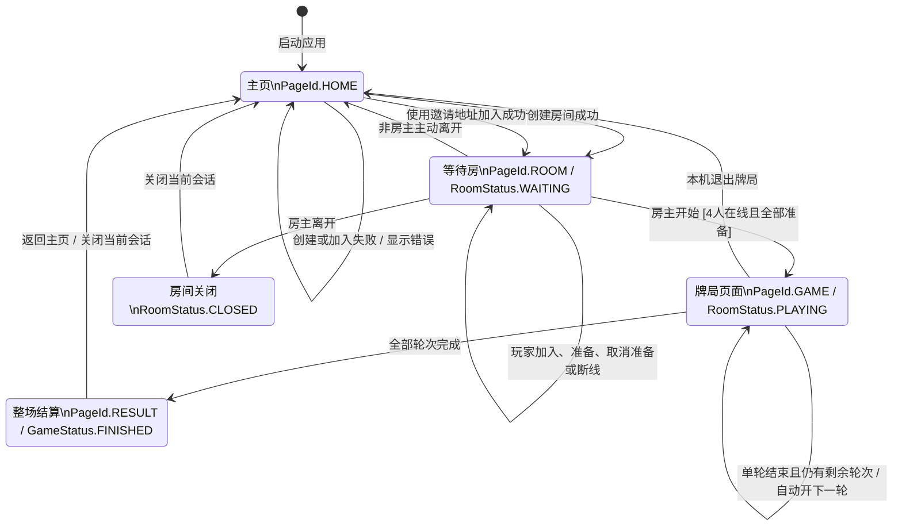
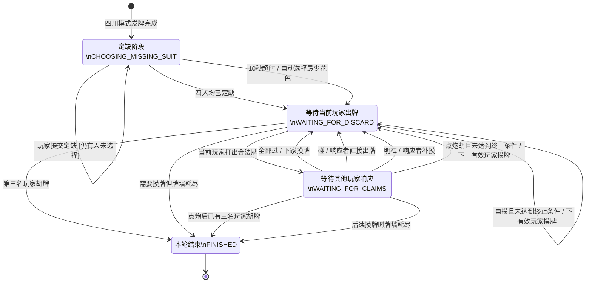

# 麻将游戏状态机与方法级设计

## 1. 文档目的与范围

本文档依据当前 `MajongGame` 工程的实际代码编写，用于完成以下设计要求：

1. 绘制游戏主流程状态机和四川麻将单局子状态机。
2. 为两套状态机提供对应的状态转移表。
3. 描述核心接口、领域类和基础设施实现的方法签名。
4. 明确方法的参数、返回值、前置条件、后置条件及代码落点。

本文档只描述现有设计，不要求修改 Java 类、FXML 页面、CSS 样式或项目包结构。

## 2. 状态定义与代码依据

| 设计层次 | 状态来源 | 当前工程中的有效状态 | 说明 |
| --- | --- | --- | --- |
| 页面流程 | `MahjongTypes.PageId`、`AppNavigator` | `HOME`、`ROOM`、`GAME`、`RESULT` | 当前导航器实际提供主页、等待房、牌局和结算页 |
| 房间生命周期 | `MahjongTypes.RoomStatus` | `WAITING`、`PLAYING`、`CLOSED` | `READY_CHECK`、`FINISHED` 已定义，但当前 `RoomManager` 尚未写入这两个状态 |
| 对局生命周期 | `MahjongTypes.GameStatus` | `PLAYING`、`FINISHED` | 快照由 `InMemoryGameSessionService` 根据 `MahjongMatch.finished()` 生成 |
| 单局牌局 | `RoundPhase` | `CHOOSING_MISSING_SUIT`、`WAITING_FOR_DISCARD`、`WAITING_FOR_CLAIMS`、`FINISHED` | `WAITING_FOR_DRAW` 已定义，但当前摸牌在服务端内部同步完成，不会停留在该状态 |

以上区分可以避免把“已定义但尚未实际使用”的枚举值误画成当前已经实现的流程。

## 3. 主流程状态机

主流程以玩家看到的页面为外层状态，同时标注服务端房间和牌局的权威状态。

### 3.1 主流程状态转移表

| 编号 | 当前状态 | 触发事件/入口 | 前置或守卫条件 | 主要处理 | 下一状态 | 失败处理 |
| --- | --- | --- | --- | --- | --- | --- |
| M01 | 初始 | `AppNavigator.start(Stage)` | JavaFX 舞台可用，FXML 可加载 | 创建场景并加载主页 | `HOME` | FXML 读取失败时抛出 `IOException` |
| M02 | `HOME` | `LanSession.host(player, settings)` | 昵称和房间设置有效；默认端口可监听 | 启动 `GameServer`、连接本机服务端、创建房间和邀请码 | `ROOM / WAITING` | 异步返回异常，主页显示根异常信息 |
| M03 | `HOME` | `LanSession.join(player, invitation)` | 邀请地址符合 `IP:端口#房间码`；房间存在且未开始 | 建立 TCP 连接并调用 `joinByInviteCode` | `ROOM / WAITING` | 保持主页并显示连接/校验错误 |
| M04 | `WAITING` | 玩家加入 | 房间未开始、未满四人、密码正确、昵称不重复 | 分配第一个空闲座位，广播新房间快照 | `WAITING` | 服务端拒绝请求，状态不变 |
| M05 | `WAITING` | `setReady(...)` | 操作者属于房间且房间仍在等待 | 更新准备状态并递增房间 `revision` | `WAITING` | 非成员或已开局时拒绝 |
| M06 | `WAITING` | `start(roomId, ownerId)` | 操作者是房主；四名玩家全部在线且准备 | 创建 `GameId` 和 `MahjongMatch`，广播房间及牌局快照 | `PLAYING` | 条件不满足时仍为 `WAITING` |
| M07 | `WAITING` | 非房主 `leave(...)` | 玩家属于房间 | 移除成员并广播房间快照 | `HOME`（本机） | 非成员时拒绝 |
| M08 | `WAITING/PLAYING` | 房主 `leave(...)` | 房主连接有效 | 将房间设为 `CLOSED`，广播后从服务端房间表移除 | `CLOSED`，随后本机返回 `HOME` | 非房主不会关闭房间 |
| M09 | `PLAYING` | `perform(ActionRequest)` | 玩家属于本局；动作合法；`expectedRevision` 等于最新版本 | 在房主端串行执行动作并广播个性化 `GameSnapshot` | `PLAYING` | 返回 `accepted=false` 和最新快照 |
| M10 | `PLAYING` | 单轮进入 `RoundPhase.FINISHED` | 当前轮已流局或达到四川血战终止条件 | 记录流水与累计积分；若未到总轮数则自动创建下一轮 | `PLAYING` | 不适用 |
| M11 | `PLAYING` | `MahjongMatch.finished()==true` | 当前轮结束且 `roundNumber >= settings.rounds()` | 快照状态输出为 `GameStatus.FINISHED`；进入结算页时保存本机积分和流水 | `RESULT` | 轮次未全部完成时不允许进入结算；SQLite 保存失败时仍保留结算展示 |
| M12 | `RESULT` | `returnHome()` | 结算页已经完成初始化 | 关闭 `LanSession` 并加载主页 | `HOME` | 页面加载异常时由导航器抛出状态异常 |

## 4. 四川麻将单局子状态机

该子状态机由 `MahjongRound` 维护。客户端只能提交意图，实际状态转移由房主端完成。

> `WAITING_FOR_DRAW` 没有出现在当前有效路径中：`drawFor(Seat)` 会在一次服务端临界区内完成摸牌，并直接把阶段设置为 `WAITING_FOR_DISCARD`。

### 4.1 四川麻将子状态转移表

| 编号 | 当前阶段 | 事件/方法 | 前置或守卫条件 | 主要处理与优先级 | 下一阶段 | 版本变化 |
| --- | --- | --- | --- | --- | --- | --- |
| R01 | 初始化 | `MahjongRound.start(settings, seed)` | 设置非空；四川规则可解析；牌墙足够发牌 | 洗牌、每家发13张、东家额外摸1张、启动10秒定缺计时 | `CHOOSING_MISSING_SUIT` | 初始 `revision=0` |
| R02 | `CHOOSING_MISSING_SUIT` | `chooseMissingSuit(seat, suit, revision)` | 版本匹配；玩家未定缺；花色是万/筒/条 | 保存该玩家定缺 | 原状态或 `WAITING_FOR_DISCARD` | 四人完成时 `+1` |
| R03 | `CHOOSING_MISSING_SUIT` | `expireMissingSuitSelection(now)` | 当前时间达到截止时间 | 为未选择玩家填入推荐花色 | `WAITING_FOR_DISCARD` | `+1` |
| R04 | `WAITING_FOR_DISCARD` | `discard(seat, tile, revision)` | 版本匹配；轮到该玩家；牌在其牌组中；存在缺门牌时必须先打缺门牌 | 移除弃牌；将摸牌并入已整理手牌；记录最后出牌；自动为无响应动作玩家填 `PASS` | `WAITING_FOR_CLAIMS`，或立即结算响应 | `+1`，结算响应可能继续增加 |
| R05 | `WAITING_FOR_CLAIMS` | `submitClaim(seat, PASS, revision)` | 非出牌者；尚未响应；`PASS` 在合法动作中 | 记录响应；三家都响应后进行仲裁 | 原状态或 `WAITING_FOR_DISCARD` | 仲裁完成后增加 |
| R06 | `WAITING_FOR_CLAIMS` | `submitClaim(seat, HU, revision)` | 加入弃牌后满足胡牌；无定缺花色残留 | 支持多人点炮胡；胡优先于杠、碰 | `WAITING_FOR_DISCARD` 或 `FINISHED` | 胡牌后继续推进 |
| R07 | `WAITING_FOR_CLAIMS` | `submitClaim(seat, GANG/PENG, revision)` | 动作由 `legalActions` 提供 | 优先级为 `HU > GANG > PENG`；同类按出牌者之后的逆时针座次选取 | `WAITING_FOR_DISCARD` | `+1`；明杠补摸还会推进版本 |
| R08 | `WAITING_FOR_CLAIMS` | 所有玩家 `PASS` | 三名非出牌者都已响应或被自动过 | 当前玩家变为出牌者的下一座位并摸牌 | `WAITING_FOR_DISCARD` | 摸牌时 `+1` |
| R09 | `WAITING_FOR_DISCARD` | `declareSelfDraw(seat, revision)` | 轮到本人；`legalActions` 包含 `HU`；无定缺牌；满足规则引擎 | 计算牌型和番数，形成零和积分变化，将玩家加入已胡集合 | `WAITING_FOR_DISCARD` 或 `FINISHED` | 后续摸牌/结束时增加 |
| R10 | `WAITING_FOR_DISCARD` | `declareConcealedGang(...)` | 当前玩家持有4张相同非缺门牌 | 移除4张牌，登记暗杠，补摸 | `WAITING_FOR_DISCARD` | 补摸时 `+1` |
| R11 | `WAITING_FOR_DISCARD` | `declareSupplementalGang(...)` | 当前玩家已有该牌的碰牌组，且持有第4张 | 将碰升级为杠并补摸 | `WAITING_FOR_DISCARD` | 补摸时 `+1` |
| R12 | 任意需要摸牌的路径 | `drawFor(seat)` | 玩家没有尚未处理的摸牌 | 从牌墙取1张放入右侧摸牌位 | `WAITING_FOR_DISCARD` | `+1` |
| R13 | 任意需要摸牌的路径 | `drawFor(seat)` | 牌墙为空 | 汇总本轮已有胡牌分数并生成流局/结束原因 | `FINISHED` | `+1` |
| R14 | 胡牌结算 | `continueAfterWin(previous)` | 已成功记录胡牌 | 已胡人数小于3时跳过已胡玩家并继续；达到3人时结束 | `WAITING_FOR_DISCARD` 或 `FINISHED` | 由摸牌或结束操作增加 |

## 5. 方法级设计约定

### 5.1 通用约定

- 所有网络用例返回 `CompletionStage<T>`，调用方不得阻塞 JavaFX UI 线程。
- `expectedRevision` 是乐观并发控制字段。提交动作时必须等于服务端最新 `revision`，否则拒绝过期操作。
- 客户端不直接修改 `RoomSnapshot` 或 `GameSnapshot`；快照由服务端生成并广播。
- 集合型返回值使用只读副本，避免调用方修改领域状态。
- 房间修改由 `RoomManager.Room` 的同步方法串行化；牌局修改由 `InMemoryGameSessionService.Context` 同步块串行化。
- 参数校验失败使用 `IllegalArgumentException`；状态或阶段不允许使用 `IllegalStateException`；身份不匹配使用 `SecurityException`。

## 6. 核心接口方法设计

### 6.1 `FriendRoomService`

设计落点：`src/main/java/com/campus/mahjong/model/service/room/FriendRoomService.java`。网络实现落点：`src/main/java/com/campus/mahjong/infrastructure/network/client/LanSession.java`；服务端状态落点：`src/main/java/com/campus/mahjong/infrastructure/network/server/RoomManager.java`。

| 方法签名 | 参数 | 返回值 | 前置条件 | 后置条件 |
| --- | --- | --- | --- | --- |
| `CompletionStage<FriendRoomAccess> create(PlayerId ownerId, FriendRoomSettings settings)` | 房主ID、房间规则 | 房间快照、邀请码、服务端地址和重连令牌 | 房主已建立连接；ID与本地身份一致；设置通过构造校验 | 新房间为 `WAITING`；房主位于 `EAST` 且默认在线、已准备 |
| `CompletionStage<FriendRoomAccess> joinByInviteCode(PlayerId playerId, String inviteCode, String password)` | 玩家ID、6位码、密码 | 加入后的访问凭据 | 房间存在且为 `WAITING`；密码正确；房间未满；昵称不重复 | 分配空闲座位，玩家在线且默认未准备；广播快照 |
| `CompletionStage<RoomSnapshot> setReady(RoomId roomId, PlayerId playerId, boolean ready)` | 房间ID、玩家ID、目标准备状态 | 最新房间快照 | 玩家属于等待中的房间 | 非房主准备状态更新；房主始终保持准备；`revision+1` |
| `CompletionStage<RoomSnapshot> updateSettings(RoomId roomId, PlayerId ownerId, FriendRoomSettings settings)` | 房间、房主和新设置 | 最新房间快照 | 应为等待阶段且操作者是房主 | 当前 LAN 初版明确返回“不支持入房后修改规则”异常，不改变状态 |
| `CompletionStage<Void> leave(RoomId roomId, PlayerId playerId)` | 房间ID、玩家ID | 无业务返回值 | 玩家属于当前房间 | 房主离开则关闭房间；等待阶段普通玩家离开则移除；牌局中离开则标记离线 |
| `CompletionStage<GameId> start(RoomId roomId, PlayerId ownerId)` | 房间ID、房主ID | 新牌局ID | 房主操作；四人全部在线且准备；房间为 `WAITING` | 创建牌局，将房间设为 `PLAYING`，广播房间与游戏快照 |
| `CompletionStage<FriendRoomAccess> reconnect(PlayerId playerId, String reconnectToken)` | 玩家ID和令牌 | 恢复后的访问凭据 | 令牌有效且身份匹配 | 接口已预留；当前 LAN 实现返回“下一阶段实现”的异常 |
| `AutoCloseable observe(RoomId roomId, Consumer<RoomSnapshot> listener)` | 房间ID、快照监听器 | 可关闭的订阅句柄 | 监听器非空，当前会话已入房 | 每次收到房间快照时通知监听器；关闭句柄后停止通知 |

### 6.2 `GameSessionService`

设计落点：`src/main/java/com/campus/mahjong/model/service/game/GameSessionService.java`。权威实现落点：`src/main/java/com/campus/mahjong/infrastructure/game/InMemoryGameSessionService.java`；远程代理落点：`LanSession.java`。

| 方法签名 | 参数 | 返回值 | 前置条件 | 后置条件 |
| --- | --- | --- | --- | --- |
| `CompletionStage<GameSnapshot> snapshot(GameId gameId, PlayerId viewer)` | 牌局ID、查看者ID | 针对该玩家裁剪的快照 | 牌局存在；查看者属于本局 | 返回公开状态、本人手牌、本人摸牌和本人可用动作；不泄露他人手牌 |
| `CompletionStage<List<ActionOption>> availableActions(GameId gameId, PlayerId playerId)` | 牌局ID、玩家ID | 当前合法动作列表 | 牌局和玩家有效 | 列表由 `MahjongRound.legalActions` 计算；不改变状态 |
| `CompletionStage<ActionResult> perform(ActionRequest request)` | 游戏、玩家、动作、关联牌、期望版本 | 接受标志、消息和最新快照 | 请求非空；身份有效；动作与阶段匹配；版本未过期 | 成功则原子修改牌局并返回新快照；失败则不提交部分修改并尽量附带最新快照 |
| `CompletionStage<Settlement> latestSettlement(GameId gameId)` | 牌局ID | 总积分变化及结束原因 | `MahjongMatch.finished()==true` | 返回整场最终积分；未结束时返回失败阶段 |
| `CompletionStage<Void> reconnect(GameId gameId, PlayerId playerId)` | 牌局ID、玩家ID | 完成信号 | 牌局存在且玩家属于该局 | 当前内存实现验证身份后成功；网络断线恢复接口仍为预留能力 |

## 7. 核心领域类方法设计

### 7.1 `MahjongRound`

设计落点：`src/main/java/com/campus/mahjong/model/game/MahjongRound.java`。该类是单轮牌局的权威状态机，所有状态修改必须集中在此处。

| 方法签名 | 参数/返回值 | 前置条件 | 后置条件 |
| --- | --- | --- | --- |
| `static MahjongRound start(FriendRoomSettings settings, long randomSeed)` | 输入规则和随机种子；返回新牌局 | 设置有效；地区规则已注册 | 构造牌墙并发牌；四川模式进入定缺阶段；相同种子可复现牌序 |
| `void chooseMissingSuit(Seat seat, TileType.Suit suit, long expectedRevision)` | 座位、缺门花色、版本；无返回值 | 定缺阶段；版本匹配；玩家未选择；花色不是字牌 | 写入定缺；四人完成后进入等待出牌 |
| `boolean expireMissingSuitSelection(long nowMillis)` | 当前时间；返回是否发生超时推进 | 处于定缺阶段且达到截止时间 | 自动填写未选玩家的推荐花色并进入等待出牌 |
| `List<TileType> discardableTiles(Seat seat)` | 座位；返回可打牌型 | 无修改型前置要求 | 若轮到该玩家，返回符合“先打缺门”的去重列表，否则返回空列表 |
| `EnumSet<PlayerActionType> legalActions(Seat seat)` | 座位；返回动作集合 | 座位存在于本局 | 依据阶段、手牌、最后弃牌和地区规则生成动作；不改变状态 |
| `void discard(Seat seat, TileType tile, long expectedRevision)` | 座位、牌、版本 | 等待出牌；轮到本人；版本匹配；牌可打 | 摸牌在确认出牌后并入并整理；弃牌加入该玩家弃牌区；进入响应阶段 |
| `void submitClaim(Seat seat, PlayerActionType action, long expectedRevision)` | 响应者、动作、版本 | 等待响应；不是出牌者；动作合法；尚未响应 | 记录响应；三家完成后按胡、杠、碰顺序仲裁 |
| `void declareSelfDraw(Seat seat, long expectedRevision)` | 自摸玩家和版本 | 等待本人出牌；合法动作包含 `HU` | 记录牌型、番数和积分；将玩家加入已胡集合并推进牌局 |
| `void declareConcealedGang(Seat seat, TileType tile, long expectedRevision)` | 玩家、杠牌、版本 | 当前玩家持有4张相同非缺门牌 | 登记暗杠，移除4张手牌并补摸 |
| `void declareSupplementalGang(Seat seat, TileType tile, long expectedRevision)` | 玩家、补杠牌、版本 | 当前玩家已有对应碰牌组且持有第4张 | 将碰牌组升级为杠并补摸 |
| `void declareSelfGang(Seat seat, TileType tile, long expectedRevision)` | 玩家、牌、版本 | 等待本人出牌且动作合法 | 优先调用补杠，否则调用暗杠；对上层提供统一入口 |
| `List<TileType> selfGangTiles(Seat seat)` | 座位；返回可主动杠的牌 | 无修改型前置要求 | 返回当前回合可暗杠或补杠的牌型，不改变状态 |
| `void passRemainingClaims()` | 无参数、无返回值 | 等待响应 | 未响应玩家全部记为过并立即仲裁；仅供测试和本地演示 |
| `RoundPhase phase()` / `long revision()` / `Seat currentTurn()` | 无参数；返回当前状态 | 无 | 只读查询，不暴露可变内部对象 |
| `List<TileType> hand(Seat seat)` / `discards(Seat seat)` / `melds(Seat seat)` | 座位；返回只读副本 | 座位有效 | 返回快照式集合，调用者修改不会影响领域状态 |

### 7.2 `MahjongMatch`

设计落点：`src/main/java/com/campus/mahjong/model/game/MahjongMatch.java`。该类负责跨轮次累计积分、生成流水和自动开始下一轮。

| 方法签名 | 参数/返回值 | 前置条件 | 后置条件 |
| --- | --- | --- | --- |
| `MahjongMatch(FriendRoomSettings settings, long seed, int firstRound)` | 房间规则、随机种子、首轮序号 | 设置有效；首轮序号在业务允许范围内 | 创建第一轮；四家累计积分初始化为0 |
| `void apply(Seat seat, PlayerActionType action, TileType tile, long expectedRevision)` | 玩家、动作、可选牌、整场版本 | 整场未结束；版本匹配；动作属于已支持集合 | 将动作路由到 `MahjongRound`，随后同步流水、分数和轮次 |
| `void synchronizeRound()` | 无参数、无返回值 | 整场对象有效 | 处理定缺超时；记录尚未入账的胡牌；单轮结束后开始下一轮或设置 `finished=true` |
| `long revision()` | 无参数；返回整场版本 | 无 | 返回 `revisionOffset + round.revision()`，保证跨轮次单调增加 |
| `List<ScoreEntry> ledger()` / `Map<Seat,Long> scores()` | 返回流水/累计分数只读副本 | 无 | 不允许外部修改整场账本和积分 |

### 7.3 `RegionalRuleSet` 与 `SichuanRuleSet`

接口落点：`src/main/java/com/campus/mahjong/model/rule/region/RegionalRuleSet.java`；四川实现落点：`src/main/java/com/campus/mahjong/model/rule/region/SichuanRuleSet.java`。

| 方法签名 | 参数/返回值 | 前置条件 | 后置条件/四川实现 |
| --- | --- | --- | --- |
| `ModeCode mode()` | 返回规则模式 | 无 | 四川实现返回 `SICHUAN` |
| `String displayName()` | 返回显示名称 | 无 | 返回用于UI和文档的地区规则名称 |
| `List<TileType> buildWall()` | 返回完整牌墙 | 无 | 四川实现使用数牌牌墙，不包含字牌 |
| `boolean canWin(List<TileType> concealed, List<Meld> exposed)` | 暗牌和副露；返回能否胡牌 | 输入集合非空且牌数结构合理 | 四川实现要求最多两种数牌花色，并通过标准胡牌求值器 |
| `HandPatternAnalyzer.Analysis analyze(List<TileType> concealed, List<Meld> exposed)` | 暗牌和副露；返回牌型、番数 | 手牌已经满足可胡条件 | 生成结算使用的牌型项目和番数，不修改牌局 |

### 7.4 `SettlementCalculator`

设计落点：`src/main/java/com/campus/mahjong/model/rule/SettlementCalculator.java`。

| 方法签名 | 参数/返回值 | 前置条件 | 后置条件 |
| --- | --- | --- | --- |
| `RoundOutcome draw()` | 无参数；返回流局结果 | 牌局需要结束且没有新的赢家 | 四家变化均为0，原因标记为流局 |
| `RoundOutcome win(Seat winner, Seat supplier, boolean selfDraw, FriendRoomSettings settings, List<String> patterns, int fan)` | 胜者、点炮者、自摸标记、规则、牌型、番数 | `fan >= 1`；自摸时点炮者可为空；非自摸时点炮者有效 | 按基础倍率和封顶生成四家零和分数变化 |
| `RoundOutcome win(..., Set<Seat> activeSeats)` | 在上一签名基础上增加未胡玩家集合 | 活跃集合有效 | 血战到底中已胡玩家不再承担后续自摸付款 |

计分不变量：所有座位的 `scoreChanges` 总和必须为0；单家支付不得超过房间封顶值；算术溢出由 `Math.multiplyExact` 显式暴露。

### 7.5 `GameRecordRepository`

接口落点：`src/main/java/com/campus/mahjong/model/repository/GameRecordRepository.java`；SQLite 实现落点：`src/main/java/com/campus/mahjong/infrastructure/persistence/repository/SqliteGameRecordRepository.java`；调用落点：`SettlementController.persist(...)`。

| 方法签名 | 参数/返回值 | 前置条件 | 后置条件 |
| --- | --- | --- | --- |
| `void recordRound(String recordId, String roomCode, ModeCode mode, int round, Map<PlayerId,PlayerRoundScore> scores, Set<PlayerId> winners)` | 记录ID、房间码、模式、轮次、分数、赢家集合 | 输入值可写入数据库；同一 `recordId` 可安全重试 | 在同一事务中补建/更新玩家、保存该轮战绩并更新累计统计；记录已存在时回滚并直接返回 |
| `void recordLedger(String matchId, List<ScoreEntry> entries, Map<Seat,String> names)` | 整场ID、逐笔流水、座位昵称 | 整场已经结束；流水序号和轮次有效 | 保存可审计的付款方、收款方、金额、原因和牌型 |
| `List<FriendScoreEntry> leaderboard(int limit)` | 最大条数；返回排名 | 数据库可连接 | 按累计积分、胜场降序返回；`limit < 1` 时按1处理；不修改数据 |
| `List<FriendScoreEntry> recentOpponents(PlayerId playerId, int limit)` | 玩家ID、条数 | 玩家ID有效；数据库可连接 | 返回最近同桌好友统计；`limit < 1` 时按1处理 |
| `List<GameRecord> recentGames(PlayerId playerId, int limit)` | 玩家ID、条数 | 玩家ID有效；数据库可连接 | 返回最近对局摘要；`limit < 1` 时按1处理 |

## 8. 设计落点总览

| 设计职责 | 接口/模型落点 | 实现/调用落点 |
| --- | --- | --- |
| 页面主流程 | `MahjongTypes.PageId` | `AppNavigator`、四个页面 Controller |
| 房间状态机 | `RoomStatus`、`FriendRoomService` | `RoomManager.Room`、`LanSession` |
| 对局用例 | `GameSessionService`、`GameSnapshot`、`ActionRequest` | `InMemoryGameSessionService`、`LanSession` |
| 单轮状态机 | `RoundPhase`、`PlayerActionType` | `MahjongRound` |
| 跨轮管理 | `ScoreEntry`、`RoundOutcome` | `MahjongMatch` |
| 四川规则 | `RegionalRuleSet` | `SichuanRuleSet`、`RegionalRules` |
| 计分 | `RoundOutcome`、`Settlement` | `SettlementCalculator` |
| 联机串行化与广播 | `MessageEnvelope`、`Payloads` | `GameServer`、`RoomManager`、`GameNetworkClient` |
| 本地持久化与排名 | `GameRecordRepository` | `SqliteGameRecordRepository`、`SettlementController` |

## 9. 设计核对结论

1. 主流程已覆盖创建/加入房间、等待与准备、开始游戏、多轮推进、结算及返回主页。
2. 子状态机覆盖四川麻将的定缺、摸牌、出牌、响应、碰杠胡、血战继续和流局结束。
3. 状态转移由房主端权威对象执行，客户端只发送带版本号的动作请求，符合局域网多人一致性要求。
4. 方法级设计已经落到现有接口、领域类、网络实现和 SQLite 仓储，未引入新的包或代码结构。
5. 当前枚举中的 `RoomStatus.READY_CHECK`、`RoomStatus.FINISHED`、`GameStatus.PREPARING/DEALING/SETTLING/ABORTED` 和 `RoundPhase.WAITING_FOR_DRAW` 属于扩展预留，不应在当前实现的测试报告中声称已经实际运行。
